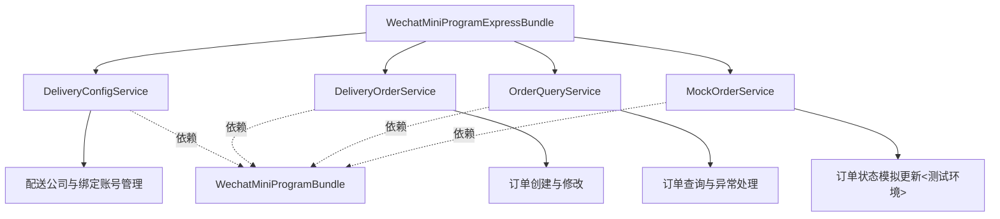
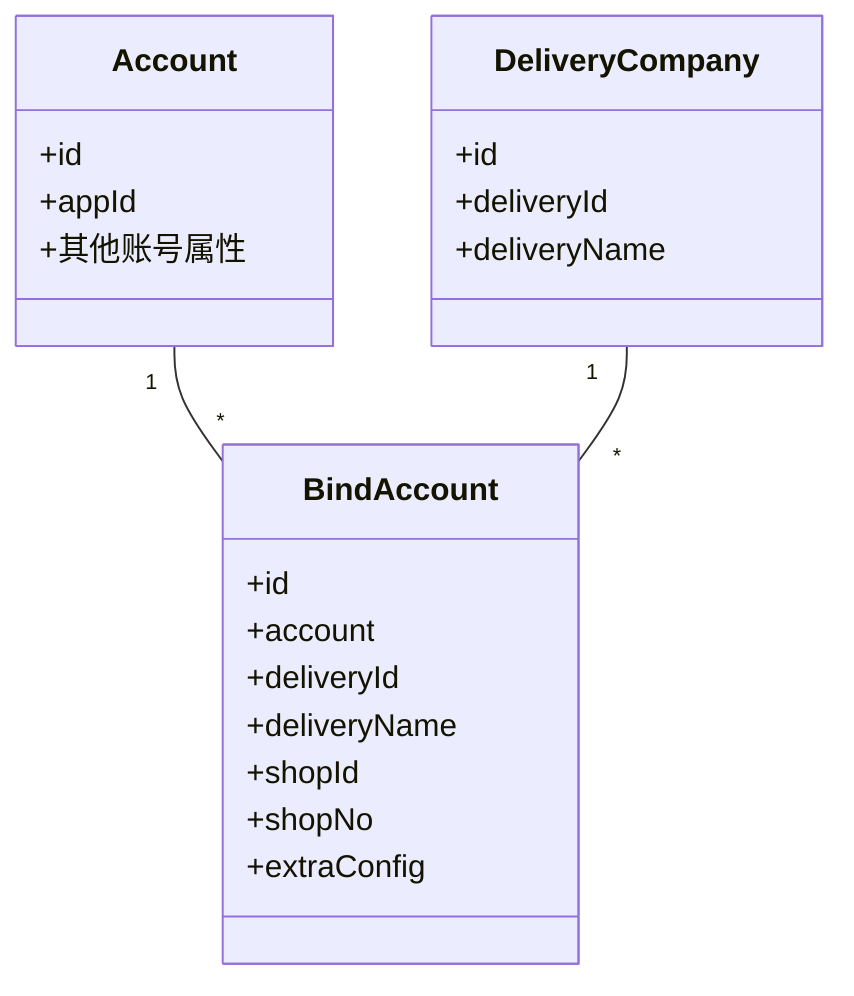
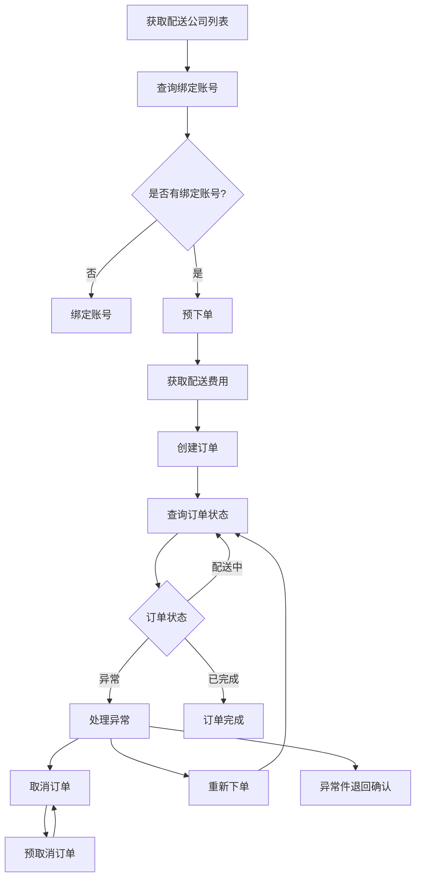

# WechatMiniProgramExpressBundle

微信小程序即时配送API集成组件，提供与微信小程序即时配送平台交互的能力，支持美团、闪送等多家配送服务提供商。

## 技术架构

该Bundle采用服务职责分离的设计，按照业务领域将功能划分为多个专注于单一职责的服务：



### 核心服务组件

Bundle按功能领域划分为四个主要服务：

1. **DeliveryConfigService**：负责配置相关功能
   - 配送公司数据同步与管理
   - 商户绑定账号信息维护
   - 数据持久化到数据库

2. **DeliveryOrderService**：专注订单操作
   - 预下单、正式下单
   - 预取消、取消订单
   - 重新下单、增加小费等修改操作

3. **OrderQueryService**：专注查询功能
   - 订单状态查询
   - 异常处理（如退回商家确认）

4. **MockOrderService**：测试环境专用
   - 模拟配送单状态更新
   - 模拟配送公司操作
   - 仅用于开发测试，生产环境不应使用

## 数据模型

### 实体关系



### DeliveryCompany

配送公司实体，存储支持的配送服务提供商信息：

- `id`: 数据库主键
- `deliveryId`: 配送公司唯一标识
- `deliveryName`: 配送公司名称

### BindAccount

绑定账号实体，记录小程序与配送公司的绑定关系：

- `id`: 数据库主键
- `account`: 关联的微信小程序账号（关联到WechatMiniProgramBundle的Account实体）
- `deliveryId`: 配送公司ID
- `deliveryName`: 配送公司名称（冗余字段，便于查询）
- `shopId`: 商户ID
- `shopNo`: 商户编号
- `extraConfig`: 额外配置信息（JSON存储）

## 技术实现

### 请求处理

Bundle基于Request/Response模式设计API通信：

1. 所有请求类继承自`WithAccountRequest`基类
2. 统一使用`WechatMiniProgramBundle`的`Client`服务发送请求
3. 采用依赖注入方式获取服务客户端

### 数据持久化

使用Doctrine ORM进行数据管理：

- 配送公司信息本地缓存，减少API调用
- 绑定账号信息持久化存储，支持查询和管理
- 服务使用`EntityManager`和自定义Repository进行数据操作

### 错误处理

统一的异常处理机制：

- 所有服务方法使用try-catch捕获异常
- 通过LoggerInterface记录详细错误信息
- 抛出自定义`WechatExpressException`类型异常

## 命令行工具

Bundle提供命令行工具用于数据同步：

1. **同步配送公司列表**

   ```bash
   bin/console wechat-express:sync-delivery-companies [--account-id=<account_id>]
   ```

2. **同步绑定账号信息**

   ```bash
   bin/console wechat-express:sync-bind-accounts [--account-id=<account_id>]
   ```

## 扩展点

Bundle设计了以下扩展点：

1. 自定义Request类实现，用于新增API支持
2. 事件监听，用于在关键操作时触发自定义业务逻辑
3. 服务装饰器，可通过服务容器配置增强现有服务功能

## 依赖关系

- **WechatMiniProgramBundle**: 提供微信账号管理和接口调用基础设施
- **DoctrineEnhanceBundle**: 提供增强的ORM功能支持

# 微信小程序即时配送模块

本模块用于实现微信小程序即时配送功能。

## 功能说明

- 配送公司管理
  - 获取配送公司列表
  - 查看配送公司列表
- 账号管理
  - 获取已绑定账号
  - 查看绑定账号信息
- 订单管理
  - 预下单（获取配送费用）
  - 下单
  - 预取消订单
  - 取消订单
  - 重新下单
  - 查询订单
  - 增加小费
  - 异常件退回确认
  - 模拟更新配送单状态（测试用）
  - 模拟配送公司更新配送单状态（测试用）

## 即时配送流程



## 核心实体

### Order 订单实体

订单实体是整个即时配送功能的核心，包含以下嵌入式实体：

- `SenderInfo`: 发送方信息
- `ReceiverInfo`: 接收方信息
- `CargoInfo`: 货物信息
- `OrderInfo`: 订单信息
- `ShopInfo`: 商品信息

### DeliveryCompany 配送公司实体

存储配送公司信息，包括：

- 配送公司ID
- 配送公司名称
- 配送公司编码

### BindAccount 绑定账号实体

存储已绑定的配送账号信息，包括：

- 绑定账号ID
- 配送公司ID
- 账号状态
- 绑定时间

## 核心服务

### DeliveryConfigService

配置服务，用于管理配送公司和绑定账号。

主要功能：

- 获取配送公司列表
- 查询绑定账号信息

### DeliveryOrderService

订单管理服务，用于处理订单创建和取消等操作。

主要功能：

- 预下单（获取配送费）
- 下单
- 预取消订单
- 取消订单
- 重新下单

### OrderQueryService

订单查询服务，用于查询订单信息和处理订单额外操作。

主要功能：

- 查询订单状态
- 增加小费
- 确认异常件退回

### MockOrderService

模拟订单服务，专为测试环境设计，用于模拟订单状态变更。

主要功能：

- 模拟更新配送单状态
- 模拟配送公司更新配送单状态

> **注意**：该服务仅用于开发和测试阶段，生产环境不应使用这些接口。

## API参考

- [获取配送公司列表](https://developers.weixin.qq.com/miniprogram/dev/OpenApiDoc/immediate-delivery/deliver-by-business/getAllImmeDelivery.html)
- [拉取已绑定账号](https://developers.weixin.qq.com/miniprogram/dev/OpenApiDoc/immediate-delivery/deliver-by-business/getBindAccount.html)
- [预下配送单](https://developers.weixin.qq.com/miniprogram/dev/OpenApiDoc/immediate-delivery/deliver-by-business/preAddOrder.html)
- [下配送单](https://developers.weixin.qq.com/miniprogram/dev/OpenApiDoc/immediate-delivery/deliver-by-business/addOrder.html)
- [预取消配送单](https://developers.weixin.qq.com/miniprogram/dev/OpenApiDoc/immediate-delivery/deliver-by-business/preCancelOrder.html)
- [取消配送单](https://developers.weixin.qq.com/miniprogram/dev/OpenApiDoc/immediate-delivery/deliver-by-business/cancelOrder.html)
- [重新下单](https://developers.weixin.qq.com/miniprogram/dev/OpenApiDoc/immediate-delivery/deliver-by-business/reOrder.html)
- [查询配送单信息](https://developers.weixin.qq.com/miniprogram/dev/OpenApiDoc/immediate-delivery/deliver-by-business/getOrder.html)
- [增加小费](https://developers.weixin.qq.com/miniprogram/dev/OpenApiDoc/immediate-delivery/deliver-by-business/addTips.html)
- [异常件退回确认](https://developers.weixin.qq.com/miniprogram/dev/OpenApiDoc/immediate-delivery/deliver-by-business/abnormalConfirm.html)
- [模拟更新配送单状态](https://developers.weixin.qq.com/miniprogram/dev/OpenApiDoc/immediate-delivery/deliver-by-business/mockUpdateOrder.html)
- [模拟配送公司更新配送单状态](https://developers.weixin.qq.com/miniprogram/dev/OpenApiDoc/immediate-delivery/deliver-by-business/realMockUpdateOrder.html)
